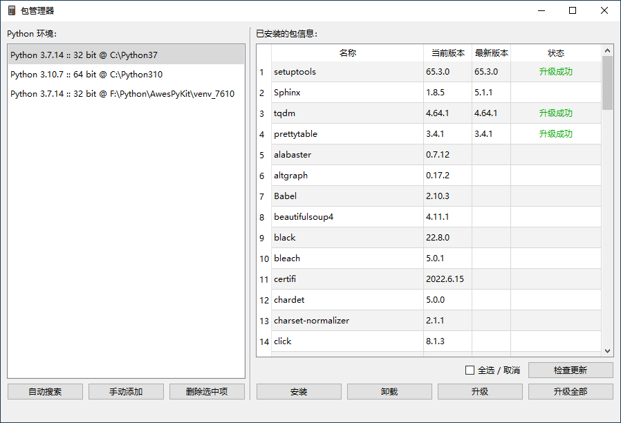
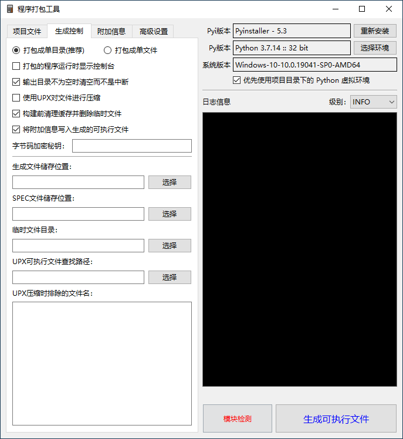
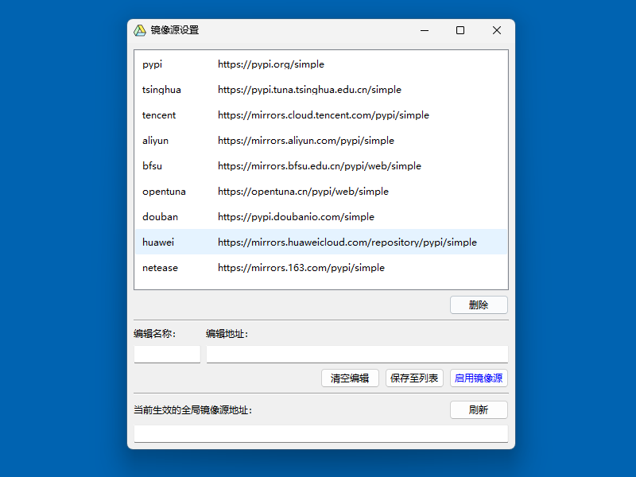
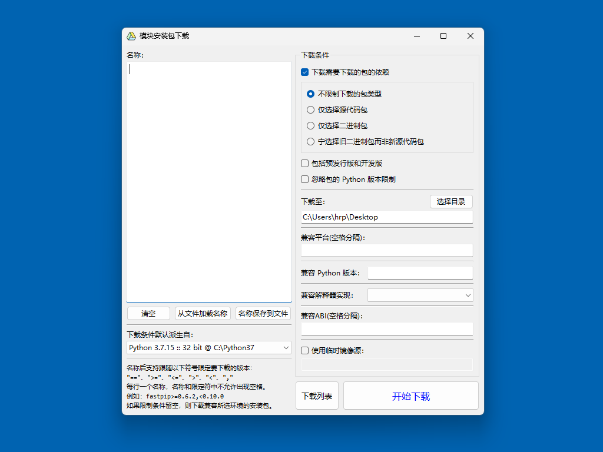

# AwesPyKit

# 快速跳转
- [程序概述](#程序概述)
- [如何运行](#如何运行)
- [程序截图](#程序截图)
- [源码仓库](#源码仓库)

<br />

# 程序概述

`仅支持在windows系统上运行`

这是一个关于 Python 的工具箱，提供包管理器、程序打包工具、镜像源设置工具、模块安装包下载器。

界面简陋，但不影响使用。

<br />

# 如何运行

> 从 exe 文件运行：

1. 打开 AwesPyKit 发布页
    [Gitee](https://gitee.com/hrpzcf/AwesomePyKit/releases)
    或
    [GitHub](https://github.com/hrpzcf/AwesomePyKit/releases)
2. 下载打包好的程序包 AwesPyKit-x.x.x.7z
3. 将压缩包解压，找到 RunPyKit.exe 双击运行

<br />

> 从源代码运行：

1. 本机安装 Python3.7 或以上版本运行环境
2. 下载源代码包 Source code.zip，解压
3. 在解压的 AwesPyKit 目录内打开 PowerShell 或 cmd
4. 安装 AwesPyKit 的依赖(有多个 Python 环境的请自行选择目标环境)

    ```cmd
    python -m pip install -r requirements.txt
    ```

5. 找到 RunPyKit.py 运行。如果不想显示控制台，可以将 RunPyKit.py 重命名为 RunPyKit.pyw

<br />

# 程序截图

> ## 包管理器：封装了 pip 命令

- 提供多 Python 环境的包管理，免于用命令行管理的混乱
    + 支持常规 Python 环境
    + 支持 venv 虚拟环境
    + 支持 Anaconda 主环境、虚拟环境
- 支持批量安装模块、按版本号安装等
- 支持检查更新、批量卸载、批量升级(不了解各包的互相依赖则请慎用批量功能)



<br/>

> ## 程序打包工具：封装了 Pyinstaller

- 封装了 Pyinstaller 的大部分常用命令
- 支持选择不同的环境进行打包操作
- 支持一键在项目下创建 venv 虚拟环境
- 支持项目所使用的 Python 环境的检查，检查出未安装的模块可一键安装



<br/>

> ## 镜像源设置工具：封装了 pip 命令

- 使用 pip 时网络不佳，用此工具一键切换 pip 所使用的镜像源
- 支持保存你自己常用的镜像源地址



<br/>

> ## 模块安装包下载器：封装了 pip 命令

- 用于特殊需求时下载各个包/库/模块的安装包
- 支持同时下载要下载的包/库/模块的依赖
- 支持从 requirement.txt 批量读取并一键下载



<br/>

# 源码仓库

> [Gitee](https://gitee.com/hrpzcf/AwesomePyKit) 或 [GitHub](https://github.com/hrpzcf/AwesomePyKit)。

<br />
