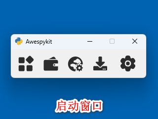
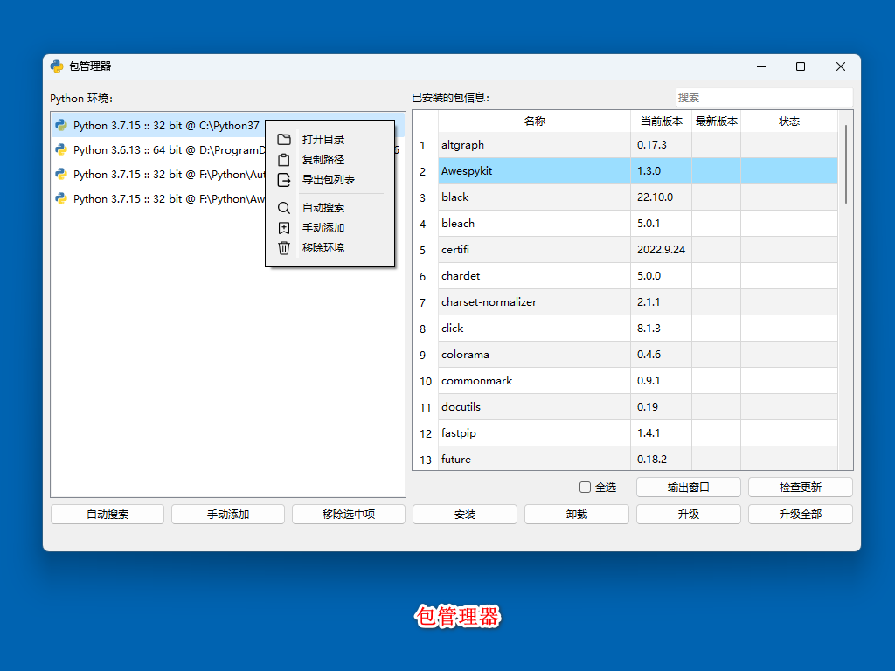
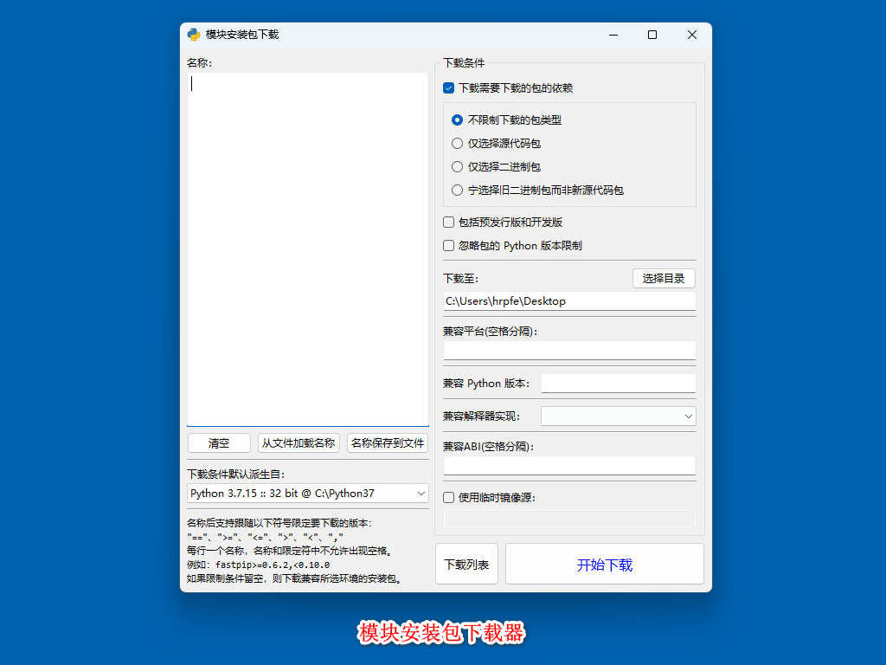

<div align="center">

<h1>Python 工具箱 - Awespykit</h1>

[](https://github.com/hrpzcf/AwesomePyKit/stargazers)
[](https://github.com/hrpzcf/AwesomePyKit/network)
[](https://github.com/hrpzcf/AwesomePyKit/issues)
[](https://github.com/hrpzcf/AwesomePyKit/blob/main/LICENSE)
[](https://github.com/hrpzcf/AwesomePyKit/releases)
[](https://pypi.org/project/Awespykit/)
[](https://pypi.org/project/Awespykit/)
[](https://pypi.org/project/Awespykit/)

</div>

## 快速跳转

[程序简介](#程序简介) **·** [如何安装和运行](#如何安装和运行) **·** [程序截图](#程序截图) **·** [源码仓库](#源码仓库)

<br />

## 程序简介

这是一个关于 Python 的工具箱，有包管理器、程序打包工具、镜像源设置工具、模块安装包下载器可用。

`注：仅支持在 Windows 系统上使用`

<br />

## 如何安装和运行

> #### 安装 Python 分发包后运行（推荐）

1. 假设你的计算机已经安装了 Python 环境，且版本 >=3.7（如果不符合要求则不能使用这个方法安装 Awespykit）。
2. 使用 pip 命令安装 Awespykit：`pip install Awespykit -U`（有多个环境的请自行选择安装环境）。
3. 安装完成后，即可在命令行窗口输入 `rpk` 启动 Awespykit。
4. 如果输入 `pip` 命令或 `rpk` 命令出现提示：`xxx 不是内部或外部命令，也不是可运行的程序或批处理文件。`
   或者`无法将 xxx 项识别为 cmdlet、函数、脚本文件或可运行程序的名称。`等提示，则说明你的 Python
   环境的路径尚未加入到系统环境变量的 PATH 变量中，请自行添加。

`推荐原因：程序开发者经常与各种命令窗口打交道，直接在命令窗口输入 'rpk + 回车' 是运行 Awespykit 最快捷的方式。`

`需要注意的是：当通过以上方式安装的 Awespykit 或者是通过源代码运行 Awespykit 时，请勿使用 Awespykit 安装、卸载、升级 Awespykit 所在 Python 环境的 Awespykit 自己(包括 Awespykit 的依赖 PyQt5)，否则可能造成文件残留或者 Awespykit 意外退出。运行打包好的 Awespykit(从 Awespykit.exe 或 runpykit.exe 文件运行) 则没有这些限制。`

<br/>

> #### 下载打包好的文件并从可执行文件运行：

1. 打开 Awespykit 新版本发布页面 [GitHub](https://github.com/hrpzcf/AwesomePyKit/releases)
   或 [Gitee](https://gitee.com/hrpzcf/AwesomePyKit/releases) 。
2. 下载 Awespykit-x.x.x.7z 或 .zip 或 .exe（每次发布的文件类型都可能不一样）。
3. 对于下载的 .7z、.zip 压缩包，请将压缩包解压，找到 runpykit.exe 双击运行；对于 exe 文件，请直接双击运行。

<br />

> #### 下载源代码并从源代码运行：

1. 假设你的计算机已经安装了 Python 环境，且版本 >=3.7。
2. `git clone` 克隆源代码到你的计算机(需要计算机上已经安装了 git)或下载源代码包 Source code.zip 解压。
3. 在 Awespykit 目录内打开 PowerShell 或 Cmd。
4. 使用以下命令安装 Awespykit 的依赖，有多个 Python 环境的请自行选择环境：
   ```cmd
   pip install -r requirements.txt
   ```
5. 找到 runpykit.py 运行。如果不想显示控制台，可以将 runpykit.py 重命名为 runpykit.pyw。
6. *注意*：由于更改了项目目录结构，使用 Pycharm 的同学，Pycharm 打开 Awespykit 目录后，请右键 Awespykit
   -> src -> awespykit 目录，选择菜单末尾的 `将目录标记为->源代码根目录` 把 `awespykit`
   目录标记为源码根目录，否则影响编程体验。

<br />

> #### 使用 pip 命令从 GitHub 安装开发版

1. 假设你的计算机已经安装了 Python 环境，且版本 >=3.7（如果不符合要求则不能使用这个方法）。
2. 使用以下命令安装开发版（可能需要你的计算机上已经安装了 git）：
   ```cmd
   pip install git+https://github.com/hrpzcf/AwesomePyKit.git@main
   ```
注意：开发版可能含有许多 BUG，无法保证程序一定能正常运行，也无法保证所有功能都正常。

<br />

## 程序截图

> ### 工具箱启动窗口



<br/>

> ### 包管理器：封装了 pip 命令

- 提供多 Python 环境的包管理，免于用命令行管理的混乱
    + 支持常规 Python 环境
    + 支持 venv 虚拟环境
    + 支持 Anaconda 主环境、虚拟环境
- 支持批量安装模块、按版本号安装等
- 支持检查更新、批量卸载、批量升级(不了解各包的互相依赖则请慎用批量功能)



<br/>

> ### 程序打包工具：封装了 Pyinstaller

- 封装了 Pyinstaller 的大部分常用命令
- 支持选择不同的环境进行打包操作
- 支持一键在项目下创建 venv 虚拟环境
- 支持项目所使用的 Python 环境的检查，检查出未安装的模块可一键安装


<br/>

> ### 镜像源设置工具：封装了 pip 命令

- 使用 pip 时网络不佳，用此工具一键切换 pip 所使用的镜像源
- 支持保存你自己常用的镜像源地址


<br/>

> ### 模块安装包下载器：封装了 pip 命令

- 用于特殊需求时下载各个包/库/模块的安装包
- 支持同时下载要下载的包/库/模块的依赖
- 支持从 requirement.txt 批量读取并一键下载



<br/>

## 源码仓库

> [Gitee](https://gitee.com/hrpzcf/AwesomePyKit) / [GitHub](https://github.com/hrpzcf/AwesomePyKit)

<br/>

## 任务列表

[可能会添加或删除的功能](./TODO.md)

<br/>
